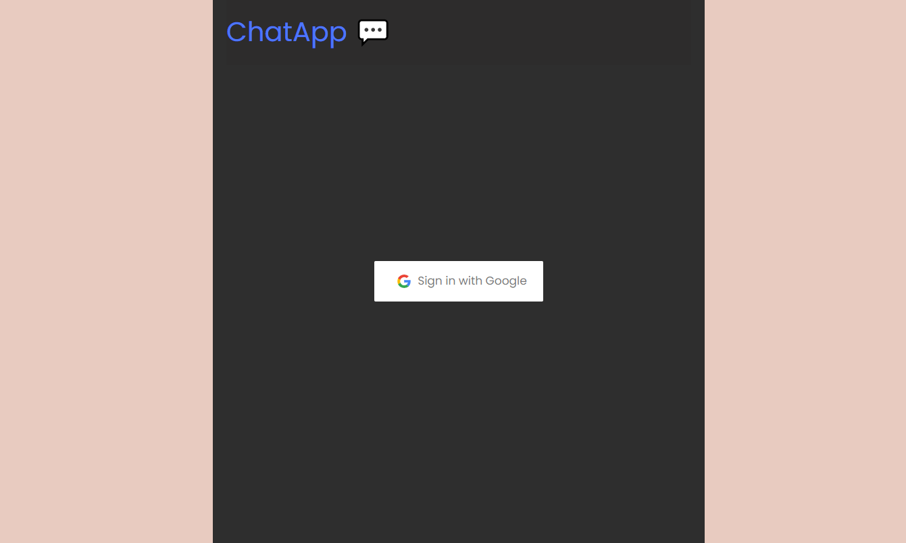
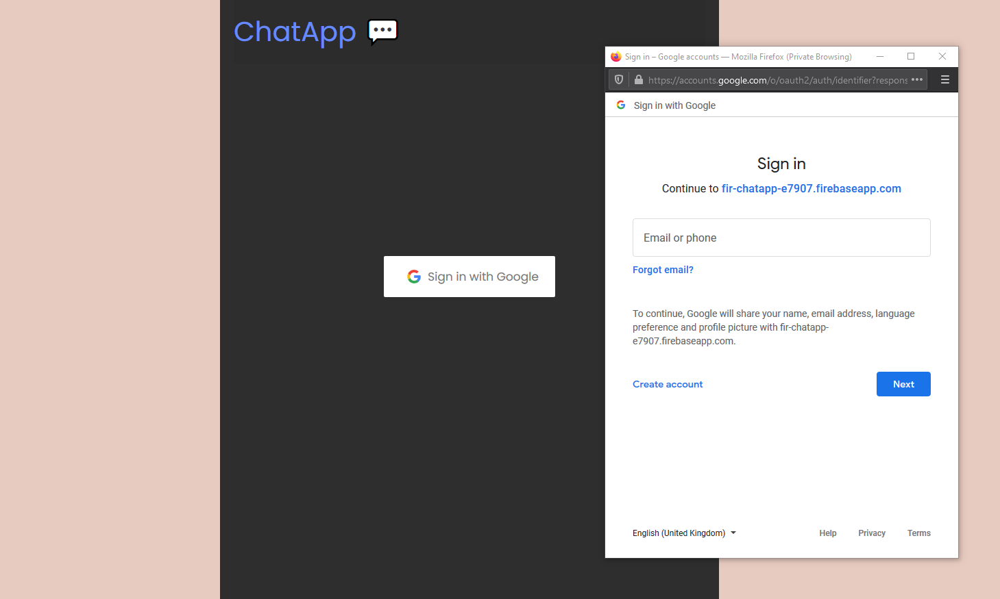
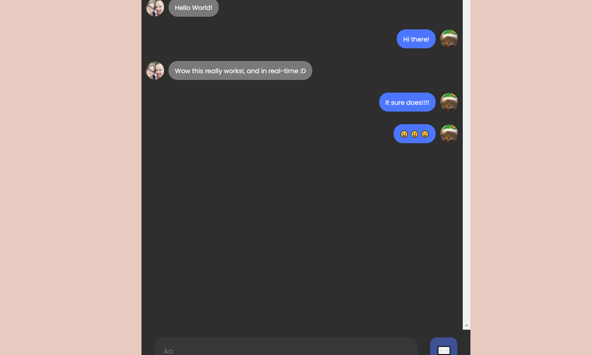

# Firebase-ChatApp

> A browser-based full-stack single group Chat Room using Google Sign-in to authenticate users allowing users to post messages in real-time.

## Table of contents

- [General info](#general-info)
- [Screenshots](#screenshots)
- [Technologies](#technologies)
- [Features](#features)
- [Contact](#contact)

## General info

This project uses Google Firebase to write and listen to data in real-time and then present it as a real-time chat application.
Users can log in securely with their Google account and access the Chatroom.

The Chatroom is loaded using a ternary operator to check whether the user is logged in or not.

Once logged in users can see 25 of the latest messages and then proceed to post in real-time.

## Screenshots

## Technologies

- React
- JavaScript
- Firebase
- CSS3
- SCSS
- HTML5

## Features

List of features ready and TODOs for future development

- Full-stack application presenting data in real-time.
- Working Google Authentication.
- Custom SCSS organized down by components.

To-do list:

- Added ability to select Emojis.
- Integrate the Giphy API to allow users to select and post gifs.

## Contact

Created by [@JordanBurch101](https://jordanburch.dev/) - feel free to contact me!
